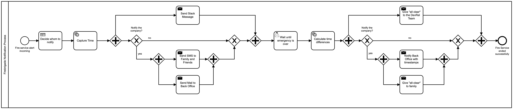
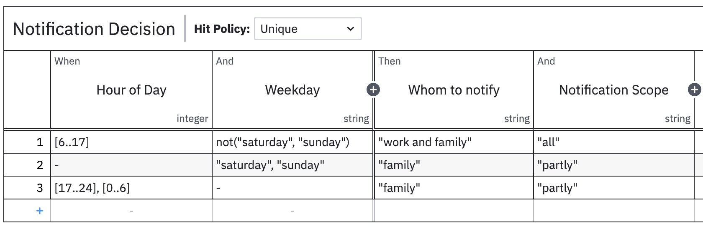

# Firebrigade-Notification-System
This repository contains exemplary code used in order to trigger a process notifying various stakeholers in case of a call to service. 
More detailed information can be found in this [Blogpost](https://camunda.com/blog/2022/04/implementing-my-fire-service-notification-system-with-camunda-platform-8/).

To notify people we make use of these external components: 
* Camunda 8 as remote workflow engine 
* Twilio to send out SMS to family members and friends 
* Slack to inform coworkers / team members

You can find the relevant process and decision in the [resources folder](./src/main/resources). 
The current process look as displayed below: 

The DMN table for deciding whom to notify looks like this: 

Some further improvements are still outstanding: 
- Adding Message Events 
- Developing a webhook in this SpringBoot Application for the Wi-Fi button to connect to 
